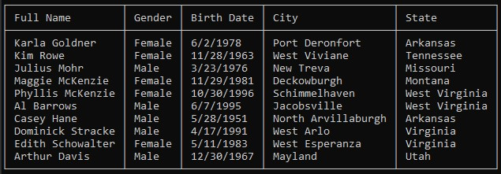

[](https://derhasse.visualstudio.com/NightStand/_build/latest?definitionId=42&branchName=master) [](https://sonarcloud.io/dashboard?id=DerekChasse_NightStand)
# NightStand
Tabular data pretty-printer in the console.

## Quick Start

Usage is simple and straight forward.

First import NightStand.

```csharp
using NightStand;
```

Then define your table.

As an example lets imagine that we want to print some information derived from `Person` objects. The following is a simple example of how to do so.


```csharp
var table = new Table<Person>
{
    Columns =
    {
        new Column<Person>("Full Name", s => s.FullName),
        new Column<Person>("Gender", s => s.Gender.ToString()),
        new Column<Person>("Birth Date", s => s.DateOfBirth.ToShortDateString()),
        new Column<Person>("City", s => s.Address.City),
        new Column<Person>("State", s => s.Address.State),
    }
};

```

Once defined that table can be passed to a `TableWriter` instance such as the `ConsoleTableWriter`.

```csharp
// Some sample data
var people = new List<Person>();

// Generate person objects...

ConsoleTableWriter<Person> consoleWriter = new ConsoleTableWriter<Person>();

consoleWriter.Draw(table: cultureTable, items: people);
```


### Sample output



## More Info
For more information, check the [documentation](./doc/index.md).