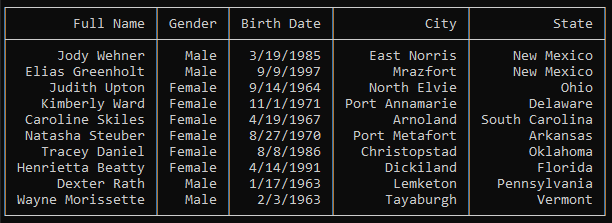

# Column Alignment

Control the text alignment within a specified column.

By default, data is left aligned, but can be configured per column as desired.  Simply provide a value from the `ColumnAlignment` enum when defining the column.

```csharp
var people = new List<Person>();

var table = new Table<Person>
{
    Columns =
    {
        new Column<Person>("Full Name", ColumnAlignment.Right, s => s.FullName),
        new Column<Person>("Gender", ColumnAlignment.Right, s => s.Gender.ToString()),
        new Column<Person>("Birth Date", ColumnAlignment.Right, s => s.DateOfBirth.ToShortDateString()),
        new Column<Person>("City", ColumnAlignment.Right, s => s.Address.City),
        new Column<Person>("State", ColumnAlignment.Right, s => s.Address.State),
    }
};

table.Draw(people);
```

## Output

