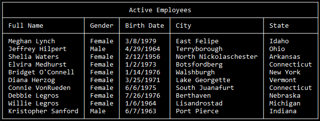

# Title Bar

Have the table draw a titlebar at the top of the table.

Text within the title bar is centered.

```csharp
var people = new List<Person>();

var table = new Table<Person>
{
    Title = "Active Employees",
    Columns =
    {
        new Column<Person>("Full Name", s => s.FullName),
        new Column<Person>("Gender", s => s.Gender.ToString()),
        new Column<Person>("Birth Date", s => s.DateOfBirth.ToShortDateString()),
        new Column<Person>("City", s => s.Address.City),
        new Column<Person>("State", s => s.Address.State),
    }
};

table.Draw(people);
```

## Output

